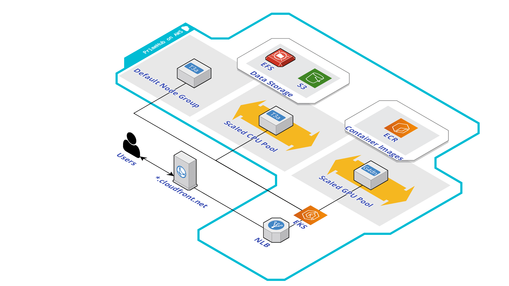

# CDK with PrimeHub on AWS EKS

This repo contains code demonstrating how to set up PrimeHub and PrimeHub ready EKS cluster by CDK.
The EKS cluster will include a Managed Node Group for PrimeHub system and 2 Auto Scaling Groups for computing tasks.


## Prerequisites

* Setup a public domain served by route 53
* AWS CLI with correct credentials configuration (Only support AWS region `ap-northeast-1` now.)
* Node.js version >= 10.13.0 (We recommend a version in active long-term support, which, at this writing, is the latest 14.x release.)
* CDK version >= 1.109
* yarn
* ts-node

## What is being deployed

* VPC without NAT gatway
* EKS cluster with Managed-nodegroup x1 and Self-managed nodes x 2
* Cluster-autoscaler on EKS
* Ingress-nginx-controller on EKS
* Cert-manager on EKS
* PrimeHub on EKS

## Usage

Way to deploy the EKS stack with AWS CDK

```bash
git clone https://github.com/InfuseAI/primehub-aws-cdk.git
cd primehub-aws-cdk
./deploy <cluster-name>
```

Way to destroy the existing EKS stack

```bash
cdk destroy
```
