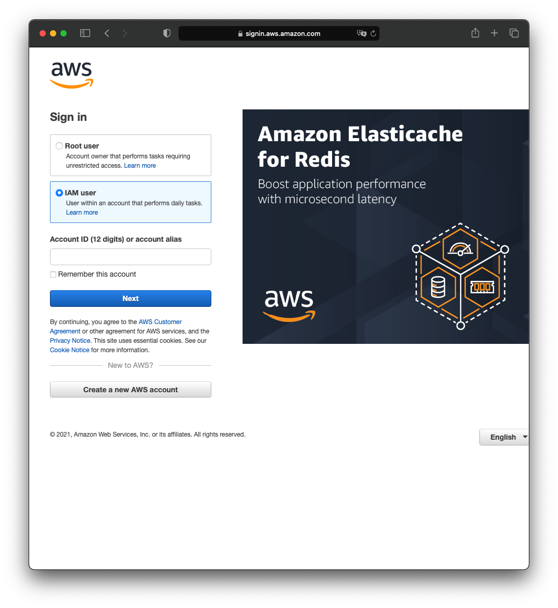
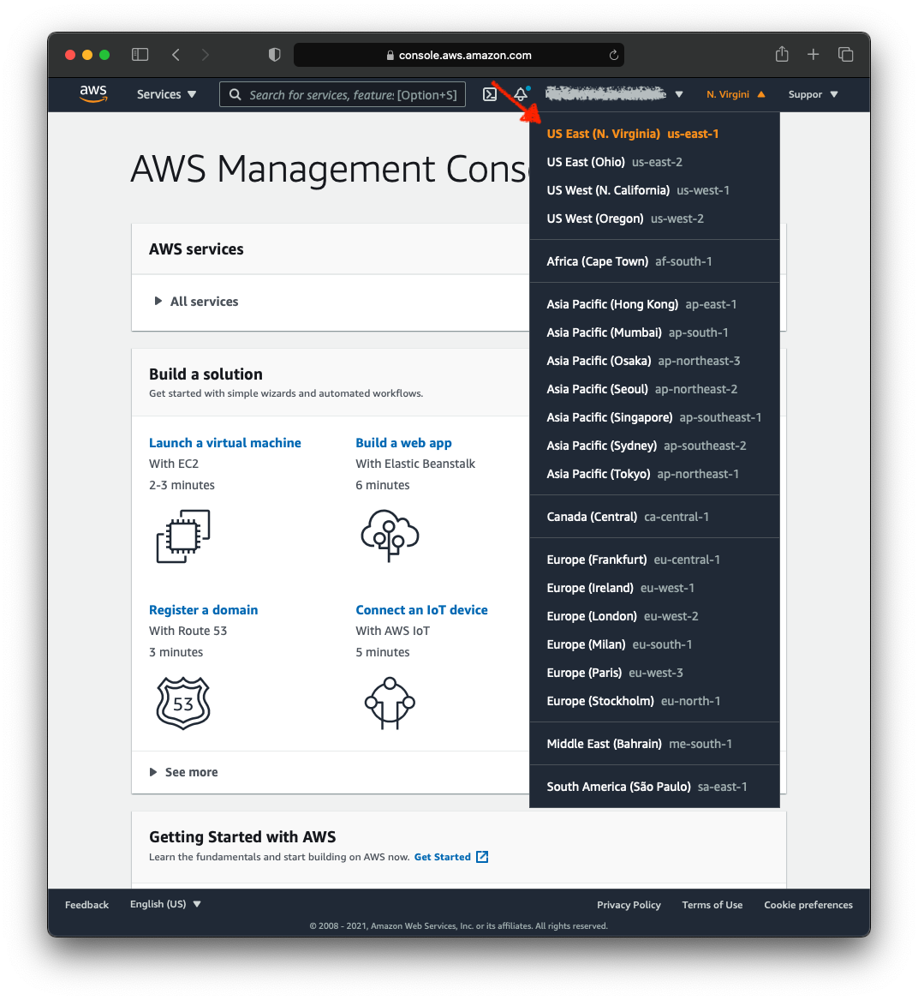
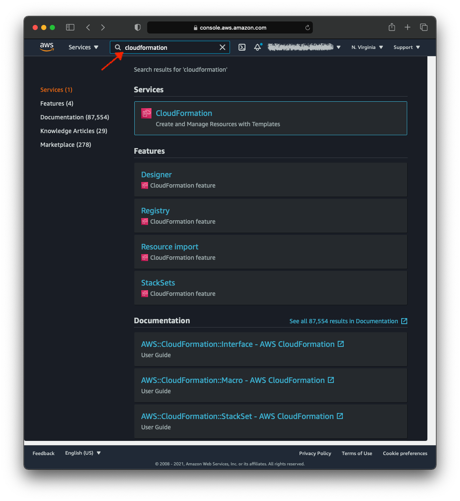
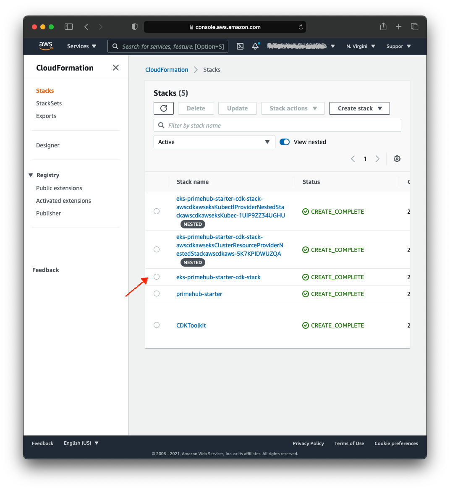
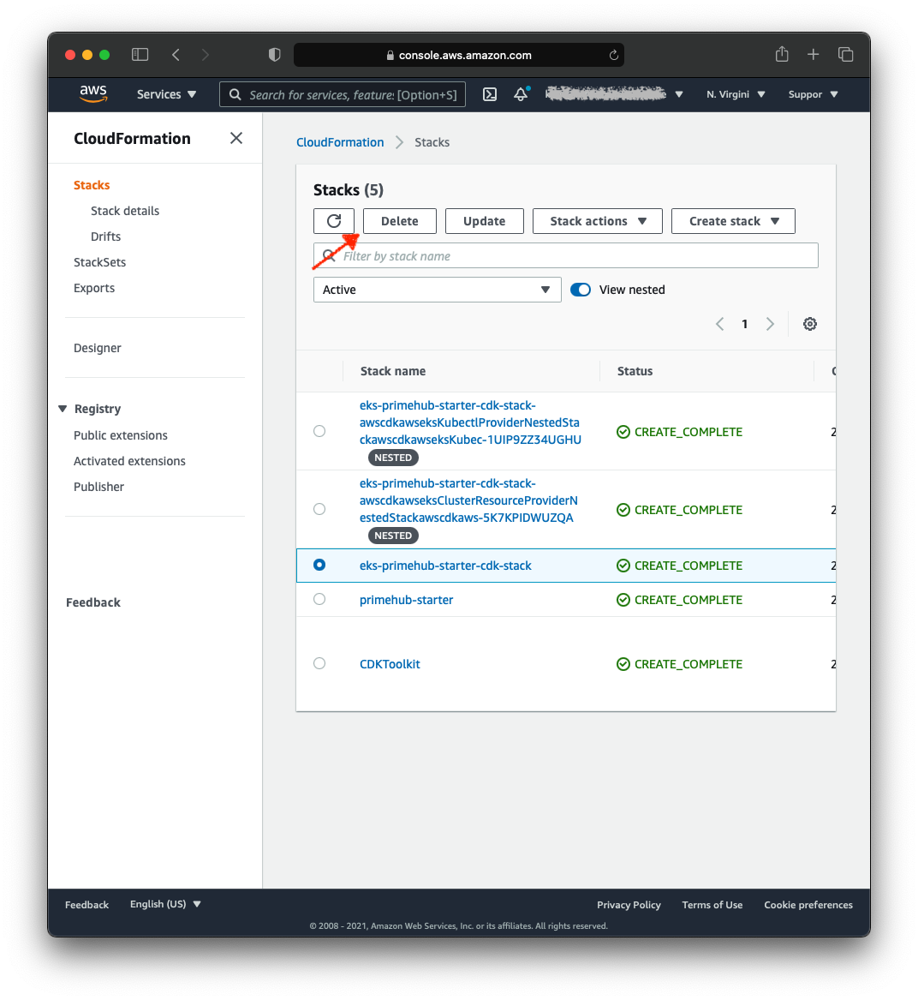

# How to destroy the PrimeHub Cluster created by `primehub-aws-cdk`

Once you want to destroy the Cluster created by PrimeHub-AWS-CDK, please follow the following steps to destroy.

## By AWS Management Console

1. Login AWS Management Console with your own AWS account

   

2. Select region US East Northern Virginia region `us-east-1`

   

3. Select AWS Services `CloudFormation`

   

4. Select your PrimeHub EKS cluster

   The name will be `eks-<cluster name>-cdk-stack`

   

5. Delete the Stack by the delete button

   

## By Command Line

1. Make sure you had installed AWS CLI

   ```bash
   $ aws --version
   aws-cli/2.2.13 Python/3.9.5 Darwin/20.6.0 source/arm64 prompt/off
   ```

2. Setup the Auth configuration of AWS with Access Key ID and Secret Access Key

   ```bash
   $ aws configure
   ```

3. Destory the CloudFormation Stack of primehub eks cluster

   ```bash
   $ aws cloudformation --region us-east-1 --stack-name eks-<cluster name>-cdk-stack
   ```

   
